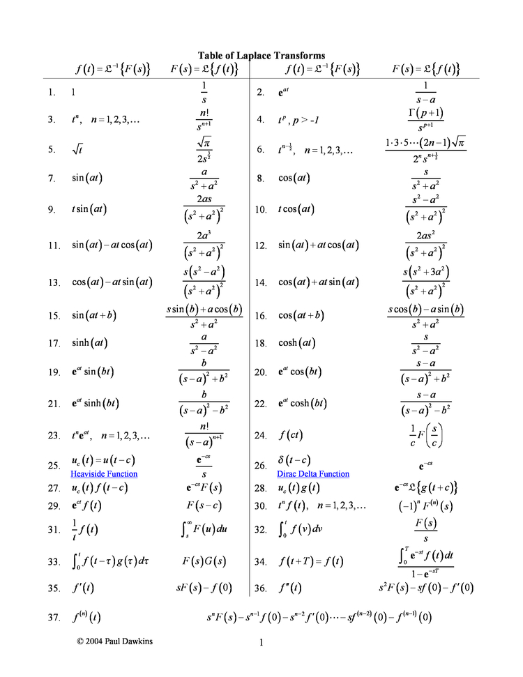

# Brief Notes + Equations
This is just a collection of notes for ES3C5 Signal Processing that I have found useful to have on hand and easily accessible.

Use `./generateTables.sh ../src/es2c5/brief-notes.md ` in the scripts folder.

<equation-table>

| [Laplace Conversion](#laplace-conversion)                              |                   |
| ---------------------------------------------------------------------- | ----------------- |
| [Laplace Table](#laplace-table)                                        | Insert table here |
| [Finding Time Domain Output $y(t)$](#finding-time-domain-output-yt)    |                   |
| [Input as Delta Function $\delta(t)$](#input-as-delta-function-deltat) | $x(t)=\delta(t)$  |
| [Input as Step Function $u(t)$](#input-as-step-function-ut)            | $x(t)=u(t)$       |
| [LTI System Properties](#lti-system-properties)                        | LTI =             |

| [Poles and Zeros](#poles-and-zeros)                                                       |                                                                                                               |
| ----------------------------------------------------------------------------------------- | ------------------------------------------------------------------------------------------------------------- |
| [General Transfer Function as 2 polynomials](#general-transfer-function-as-2-polynomials) | $H (s) = \frac{b_0s^M + b_1s^{M-1} + \cdots + b_{M-1}s + b_M}{a_0s^N + a_1s^{N-1} + \cdots + a_{N-1}s + a_N}$ |
| [Factorised Transfer Function](#factorised-transfer-function)                             | $H (s) = K \frac{(s - z_1)(s - z_2) \cdots (s - z_M)}{(s - p_1)(s - p_2) \cdots (s - p_N)}$                   |
| [Real system as real](#real-system-as-real)                                               | $M \le N$                                                                                                     |
| [Zero Definition](#zero-definition)                                                       | Roots z of the numerator. When $s =$ any $z$, $H(s)=0$                                                        |
| [Pole Definition](#pole-definition)                                                       | Poles p of the denominator. When $s =$ any $p$, $H(s)$ approaches $\inf$                                      |
| [Transfer Function Gain](#transfer-function-gain)                                         | K is th overall transfer function gain. (Where the coefficient of $s^M$ and $s^N...                           |
| [Stable System](#stable-system)                                                           | A system is considered stable if its impulse response tends to zero or a finite ...                           |
| [Components to Response](#components-to-response)                                         | Real Components $\rArr$ Exponential Response $\vert$ Imaginary $\rArr$ angular f...                           |

</equation-table>

# Part 1 - Analogue Signals and Systems

## Laplace Conversion

### Laplace Table
Insert table here

### Finding Time Domain Output $y(t)$
1. Transform $x(t)$ and $h(t)$ into Laplace domain
2. Find product $Y(s) = X(s)H(s)$
3. Take inverse Laplace transform $Y(s)$

### Input as Delta Function $\delta(t)$
$$x(t)=\delta(t)$$
Then $X(s) = 1$, so $Y(s) = H(s)$.

### Input as Step Function $u(t)$
$$x(t)=u(t)$$
Then $X(s) = \frac{1}{s}$, so $Y(s) = \frac{H(s)}{s}$.

### LTI System Properties
LTI = **Linear Time Invariant**.
- LTI systems are *linear*. Given system $F\{\}$ and signals $x_1(t)$, $x_2(t)$ etc
  - LIT is *Additive*:
    $$ F\{x_1(t) + x_2(t)\} = F \{x_1(t)\} + F\{x_2(t)\} $$
  - LTI is scalable (or *homogeneous*)
    $$ F\{\alpha{}x_1(t)\} = \alpha{}F\{x_1(t)\}$$
- LTI is *time-invariant*, ie, if output $y(t) = F\{x_1(t)\}$ then:
    - $$ y (t - \tau) = F\{x_1(t - \tau)\} $$

## Poles and Zeros
### General Transfer Function as 2 polynomials
$$ H (s) = \frac{b_0s^M + b_1s^{M-1} + \cdots + b_{M-1}s + b_M}{a_0s^N + a_1s^{N-1} + \cdots + a_{N-1}s + a_N} $$

### Factorised Transfer Function
$$ H (s) = K \frac{(s - z_1)(s - z_2) \cdots (s - z_M)}{(s - p_1)(s - p_2) \cdots (s - p_N)}$$
Is factorised and rewrite as a ratio of products:
$$ 
= K \frac{\prod{}^M_{t=1}s-z_t}{\prod{}^N_{t=1}s-p_t}
$$
### Real system as real
$$ M \le N $$
Where the numerator i a $M$th order polynomial with coefficients $b$s and the denominator is a $N$th order polynomial with coefficients $a$s. For a system to be real, the ordr of the numerator polynomial must be no greater than the order of the denominator polynomial, ie: $M \le N$.

### Zero Definition
Roots z of the numerator. When $s =$ any $z$, $H(s)=0$ 

### Pole Definition
Poles p of the denominator. When $s =$ any $p$, $H(s)$ approaches $\inf$ 

### Transfer Function Gain
K is th overall transfer function gain. (Where the coefficient of $s^M$ and $s^N$ is 1.)

### Stable System
A system is considered stable if its impulse response tends to zero or a finite value in the time domain. 

Requires all real components to be negative (on the left hand side of the complex s-plane of a pole-zero plot (left if the imaginary s axis)).

### Components to Response
Real Components $\rArr$ Exponential Response $\vert$ Imaginary $\rArr$ angular frequency of oscillating responses.

