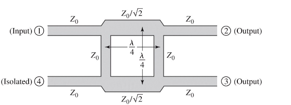
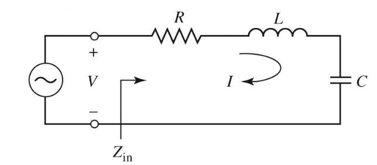
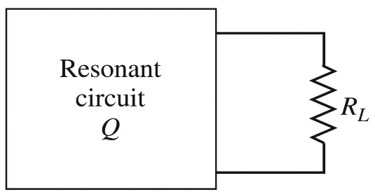
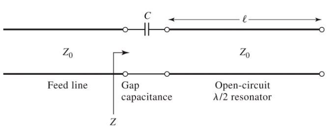
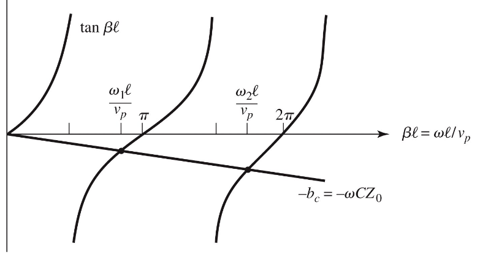

# Power Dividers, Couplers & Resonators

Power dividers divider one input signal into two or more output signals. Power couplers take two or more inputs and combine them into a single output.

## Wilkinson Power Divider

The equal split (3dB) Wilkinson power divider will be considered, although it can be designed to give arbitrary power division.

The circuit is formed of two $\lambda /4$ lines of impedance $\sqrt Z_0$, with a resisitor in shunt accross the two lines of impedance $2 \Z_0$. The scattering parameters:

- $S_{11} = 0$
  - $Z_{in} = Z_0$ at port 1, the input
- $S_{22} = S_{33} = 0$
  - Ports 2 and 3 are matched for even and odd modes of excitation
- $S_{12} = S_{21} = -j / \sqrt{2}$
  - Symmetry due to reciprocity
- $S_{13} = S_{31} = - j / \sqrt{2}$
- $S_{23} = S_{32} = 0$
  - Due to short or open circuit at the bisection

## Directional Coupler

A directional coupler is shown below

- Power supplied to port 1 is coupled to port 3
  - The coupled port
- The remainder of the input power is delivered to port 2
  - The through port
- No power is delivered to port 4
  - The isolated port

The quantities used to characterize a directional coupler:

- Coupling factor $C = 10 \log_{10}(P_1/P_3)$ - the fraction of the input power that is coupled to the output port
- Directivity $D = 10 \log_{10}(P_3/P_4)$ - a measure of the coupler's ability to isolate forward and backward waves
- Isolation $I = 10 \log_{10}(P_1/P_4)$ - the measure of the power delivered to the uncoupled port
- Insertion loss $L = 10 \log_{10}(P_1/P_2)$ - the power delievered to the output port

The quadrature hybrid directional coupler is a 3dB directional coupler with all ports matched, and input power divided evenly between ports 2 and 3. No power is coupled to port 4. The coupler is symmetrical, and any
port can be used as the input/output ports.

$$
S = \frac{-1}{\sqrt{2}}
\begin{bmatrix}
0 & j & 1 & 0 \\
j & 0 & 0 & 1 \\
1 & 0 & 0 & j \\
0 & 1 & j & 0 \\
\end{bmatrix}
$$

## Resonators

### RLC Resonators

Resonators at microwave frequency are similar to lumped element RLC circuits:

Input impedance:

$$
Z_{in} = R + j \omega L - j \frac{1}{\omega C}
$$

Power delivered:

$$
P_{in} = \frac{1}{2} Z_{in} \frac{|V_{in}|^2}{|Z_{in}|^2}
$$

The resistors dissipates power $R$, while the inductor and capacitor store energy $W_m$ and $W_e$:

$$
P_{loss} = \frac{1}{2} |I|^2 R \qquad W_m = \frac{1}[4] = |I|^2 L \qquad W_e = \frac{1}{4} |I|^2 \frac{1}{\omega^2 C}
$$

At the resonant frequency of $\omega_0 = 1/\sqrt{LC}$, $W_m = W_e$ and $Z_{in} = R$

The quality factor of a resonant circuit is defined as the ratio of energy stored to energy loss:

$$
Q(\omega) = \omega \frac{W_m + W_e}{P_{loss}}
$$

$Q$ measures the loss of the circuit: higher Q means higher loss. An external connecting network may introduce additional loss, so the $Q$ of the resonator itself (the unloaded $Q$) is:

$$
Q_0 = \frac{1}{\omega_0 RC}
$$

The input impedance of the series resonator at a frequency $\omega = \omega_0 + \Delta \omega$, where $\Delta\omega$ is small:

$$
Z_{in} \approx R = j w L \Delta \omega = R + j \frac{2RQ_0 \Delta \omega}{\omega_0}
$$

A lossy resonator can be modelled as a lossless resonant frequency $\omega_0$ replaced by a complex _effective resonant frequency_ $\omega_0(1 + j/2Q_0)$.

When the frequency $\omega$ is such that $|Z_{in}|^2 = 2 R^2$, the real power delivered to the circuit is half that as of at $\omega_0$. We use this to define the fractional bandwith as $1/Q_0$.

The same analysis can be done for a parallel RLC resonator. The properties of the two are compared in the table below

In general, resonators are coupled to other circuitry which gives a loaded $Q_L$. If we couple a resonant circuit to an external load $R_L$ and define $Q_e$, the external load, then:

$$
\frac{1}{Q_L} = \frac{1}{Q_e} + \frac{1}{Q_0}
$$

For a series RLC resonator, effective resistance is $R +R_L$, and $Q_e = \omega_0 L/R_L$. In parallel, effective resistance is $(1/R + 1/R_L)^{-1}$ and $Q_e = R_L / (\omega_0L)$

### Transmission Line Resonators

#### Open Circuit $\lambda/2$ line

A practical resonator that is often used in microstrip circuits is an open circuit length of transmission line of length $\lambda /2$, which behaves as a parallel resonator circuit. The input impedance is:

$$
Z_{in} = Z_0 \coth ((\alpha + j \beta) l)
$$

In practice, low loss transmission lines are used, so we can approximate $\tanh(\alpha l) \approx \alpha l$. Using $\omega = \omega_0 + \Delta \omega$ again for small $\Delta\omega$ near to the resonant frequency, we have:

$$
Z_{in} \approx \frac{Z_0}{\alpha l + j (\pi \Delta \omega / \omega)}
$$

At resonance, $\beta l = \pi$, the unloaded $Q$ of this resonator is:

$$
Q_0 = \omega_0 RC = \frac{\pi}{2 \alpha l} = \frac{\beta}{2 \alpha}
$$

#### Gap-Coupled Microstrip Resonator

Consider a $\lambda/2$ open-circuit microstrip gap-coupled to the end of a microstrip transmission line. The normalised input impedance is:

$$
z(\omega) = \frac{Z}{Z_0} = -j \frac{\tan (\beta l) + b_c}{b_c \tan(\beta l)} \qquad b_c = Z_0 \omega C
$$

The resonant frequency occurs when $z=0$, ie when $\tan (\beta l) = -b_c$

The first resonant frequency $\omega_1$ is close to the resonant frequency of the unloaded resonator, so we have $b_c \ll 1$. The coupling of the resonator to the feedline has the effect of lowering it's resonant frequency.

The presence of a coupling capacitor turns the uncoupled $\lambda/2$ line from a parallel to a series RLC circuit near resonance. At resonance:

$$
R = \frac{Z_0 \pi}{2 Q_0 b^2_c}
$$

For critical coupling, $Q_0/Q_1 = 1$:

$$
R = Z_0 \qquad b_c =\sqrt{\frac{\pi}{2 Q_0}}
$$
