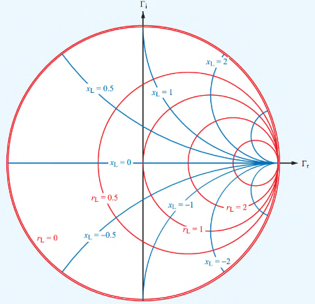
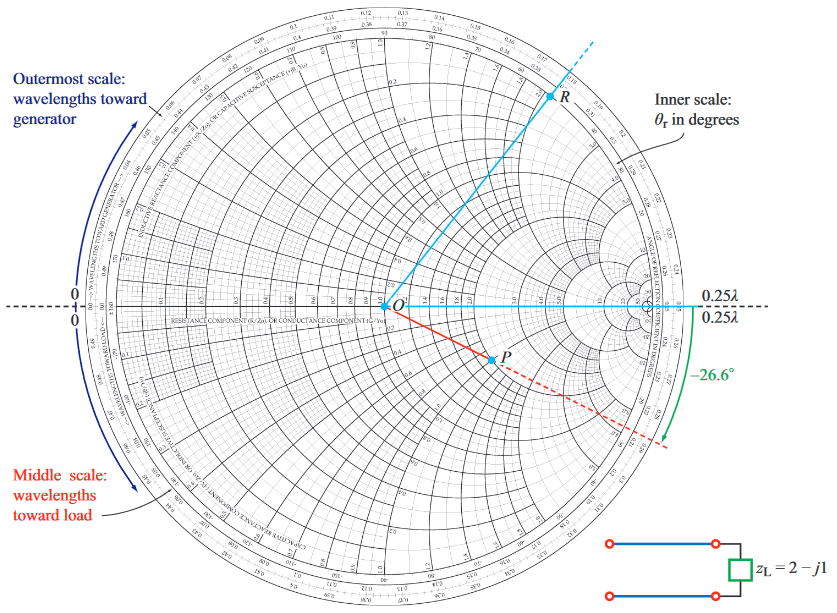
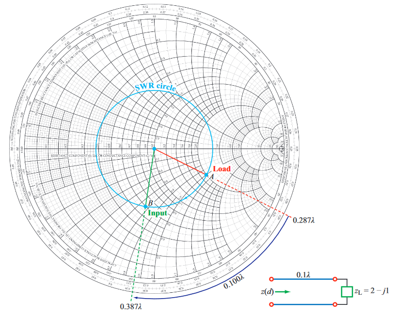

# The Smith Chart

The Smith chart is a graphical tool for analysing and designing transmission line circuits. It represents the reflection coefficient's complex plane.

The image below shows the the complex plane

- Point A is the reflection coefficient $\Gamma = 0.3 + j0.4 = 0.5 e^ {j53^\circ}$
- Point B is the reflection coefficient $\Gamma = -0.5 - j 0.2 = 0.54 e^ {j202^\circ}$

The Smith chart shows circles of constant normalised resistance $r_L$, and constant normalised reactance $x_L$, within the unit circle plane.

Given the normalised value of a load impedance $z_l = Z_L / Z_0 = r_L + j x_L$, we can find the value of the corresponding reflection coefficient, and vice-versa.

## Example

In the example below, point $P$ is plotted on the $r_L = 2$ and $x_L = -1$ lines, representing a normalised impedance of $z_L = 2 - j$.

- The length of the line between the $P$ and the centre $O$ corresponds to the magnitude of the reflection coefficient
- The angle between the x axis and the point $P$ is $-26.6 ^\circ$
- $\Gamma = 0.45 e^{-j26.6}$

## Phase Shifting

Based on the input impedance in terms of the reflection coefficient, we obtain

$$
z(-l) = \frac{Z (z=-l)}{Z_0} = \frac{1+\Gamma e^{-j2 \beta l}}{1-\Gamma e^{-j2 \beta l}} = \frac{1 + \Gamma_l}{1-\Gamma_l}
$$

$\Gamma_l$ is the phase shifted reflection coefficient. $\Gamma$ at $z = -l$ on a transmission line is equal to the reflection coefficient at the load ($z=0$), shifted by $-2 \beta l$:

$$
\Gamma_l = \Gamma e^{-j2 \beta l} = |\Gamma| e^{j \theta_\Gamma} e^{-j2 \beta l} = |\Gamma| e^{j(\theta_\Gamma - 2 \beta l)}
$$

This phase shift can be achieved on the Smith chart by maintaining constant magnitude, and decreasing the phase $\theta_L$ by the phase, corresponding to a clockwise rotation of an angle $2 \beta l$ radians.

A complete rotation of $2 \pi$ radians corresponds to a change in length of $l = \lambda/2$. The outermost scale on the chart "wavelengths toward the generator" denotes movement on the transmission line toward the source, in units of wavelength.

### Example

Point $A$ is a normalised load of $z_L = 2-j$ at $0.287\lambda$. If the load terminates a transmission line of length $0.1 \lambda$, what it's input impedance?

- Move clockwise by $0.1 \lambda$ around a constant $|\Gamma|$ circle
- Read the smith chart at point $B$ to get $z_{in} = 0.6 - j0.66$

## Admittance

For some problems, it is more convenient to work with admittances than with impedances

$$Y = G + jB = \frac{1}{Z} = \frac{1}{R + jX}$$

Normalised admittance $y$ is therefore:

$$
y = \frac{Y}{Y_0} = \frac{G}{Y_0} + j{B}{Y_0} = g + jb
$$

- Rotation by $\lambda /4$ on the SWR circle transforms $z$ into $y$, and vice-versa
- $r_L$ circles become $g_L$ circles
- $x_L circles$ become $b_L$ circles

### Example

Point $A$ represents a normalised load impedance of $z_L = 0.6 + j1.4$. Moving on the SWR circle by $\lambda /4$ gives point $B$, the corresponding normalised admittance of $y_L = 0.25 - j0.6$

